# Centerline SVG Extraction

Convert solid black PNG icons into clean **centerline SVG paths** — vector strokes that approximate the medial axis of each stroke, ready to re-draw the original glyph at the correct width.

- **Pure Python**, no third-party libraries (no numpy, no PIL, no cairo). Standard library only.
- **Reference-independent quality**: the centerlines sit close to the medial axis, so rasterizing them at the PNG stroke width reconstructs the input shape with **~93% reconstruction IoU on average** — +27.7 IoU points (~42% relative) over the provided reference SVGs.

---

## 1. What this project does

Given a folder of solid-black PNG glyphs (e.g. `letter_H.png`, `arrow-pointer.png`), it produces one SVG per glyph whose `<path>` elements trace the **centerlines** of the strokes rather than the outline.

| Input | Output |
|-------|--------|
| Raster black-on-white shape, strokes ~65 px wide | Vector SVG, a handful of centerline paths, auto stroke width ~64 px |

This is the inverse of "outline tracing": instead of bounding the shape, we collapse each stroke to its single-pixel-wide spine so it can be scaled, re-styled, or re-rendered at any width.

### Gallery

Input PNG, our centerline SVG (rendered at the auto stroke width), and an overlay of ours (red) over the reference (green) for each glyph in the sample set. The SVG column links directly to the generated files in `out/`. — render this README on GitHub or in a Markdown preview to see them stroked.

<table>
<tr><th>Glyph</th><th>Input PNG</th><th>Our SVG</th><th>Overlay (red = ours, green = reference)</th></tr>
<tr><td><code>letter_H</code></td><td>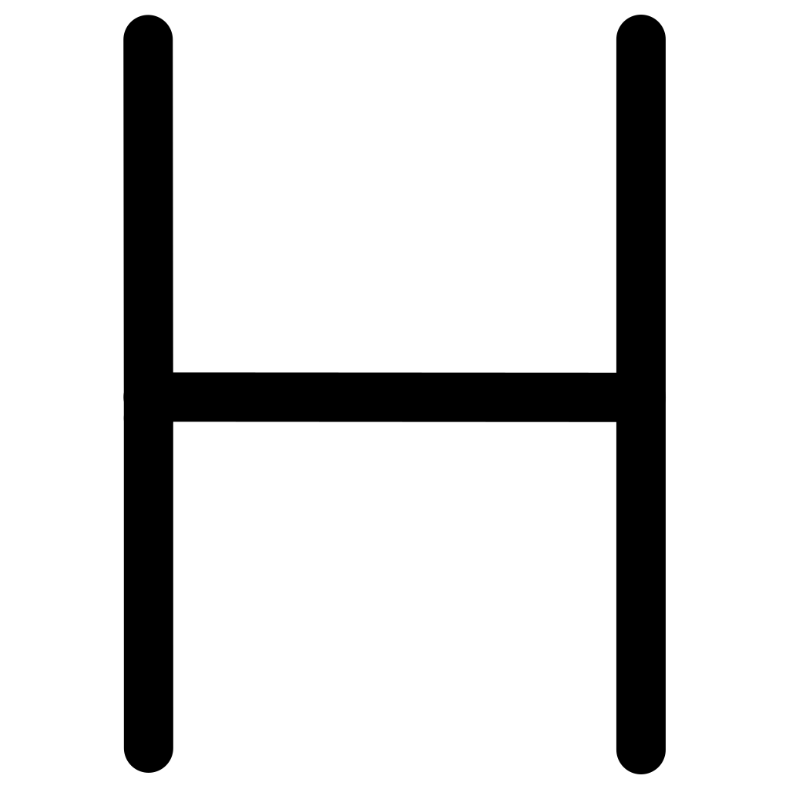</td><td></td><td>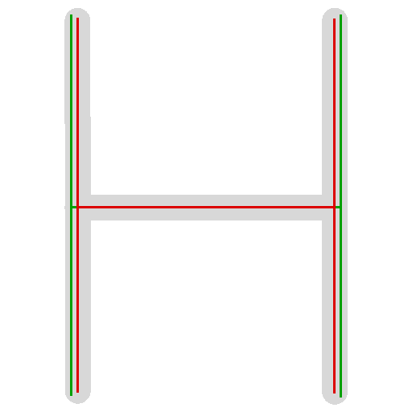</td></tr>
<tr><td><code>letter_K</code></td><td></td><td>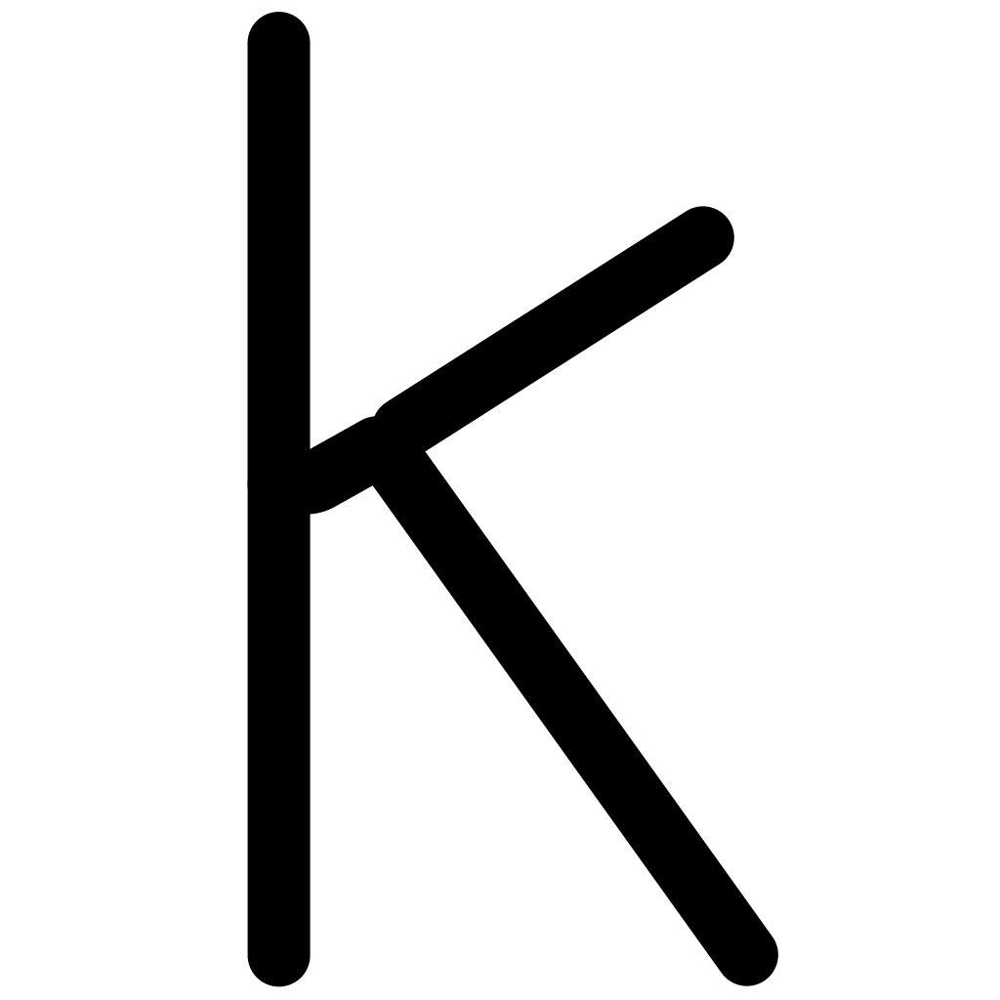</td><td>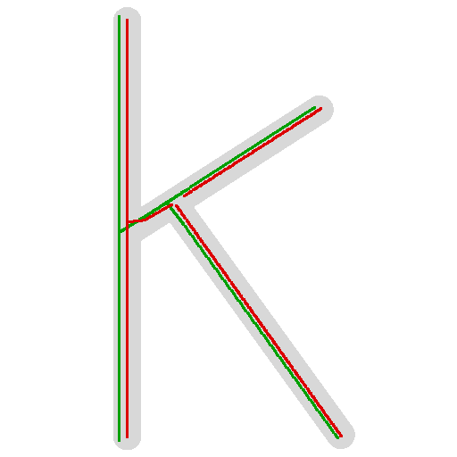</td></tr>
<tr><td><code>arrow-pointer</code></td><td></td><td></td><td>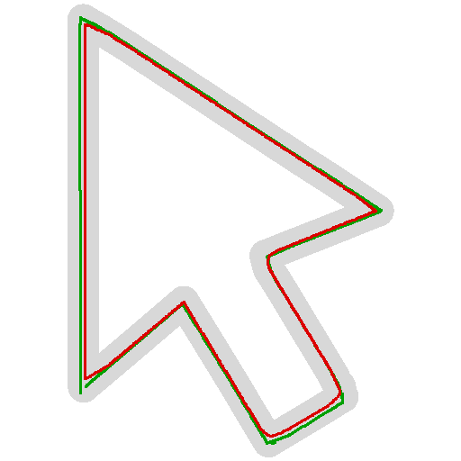</td></tr>
<tr><td><code>arrow-turn-down-left</code></td><td>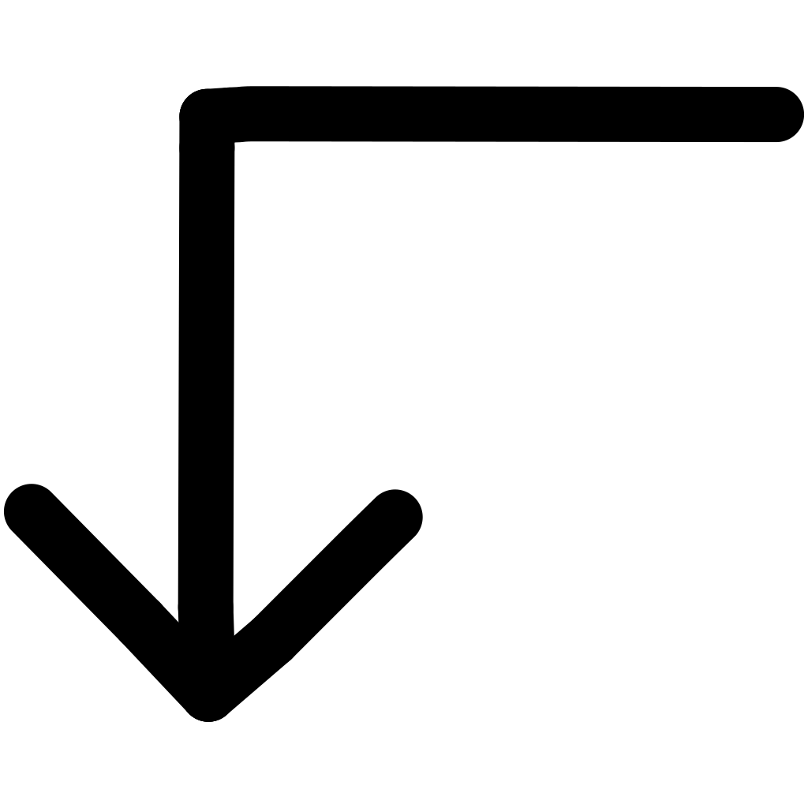</td><td></td><td>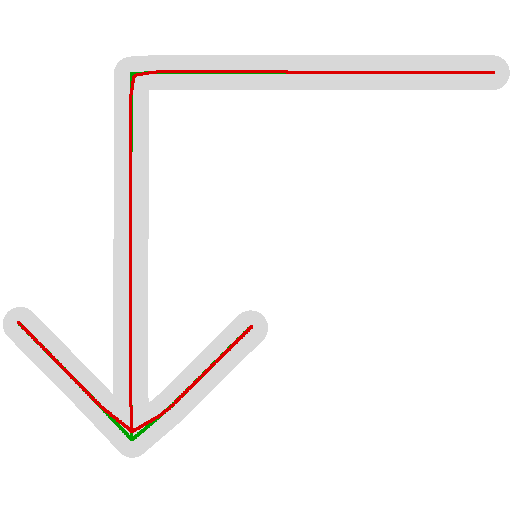</td></tr>
<tr><td><code>number_3</code></td><td>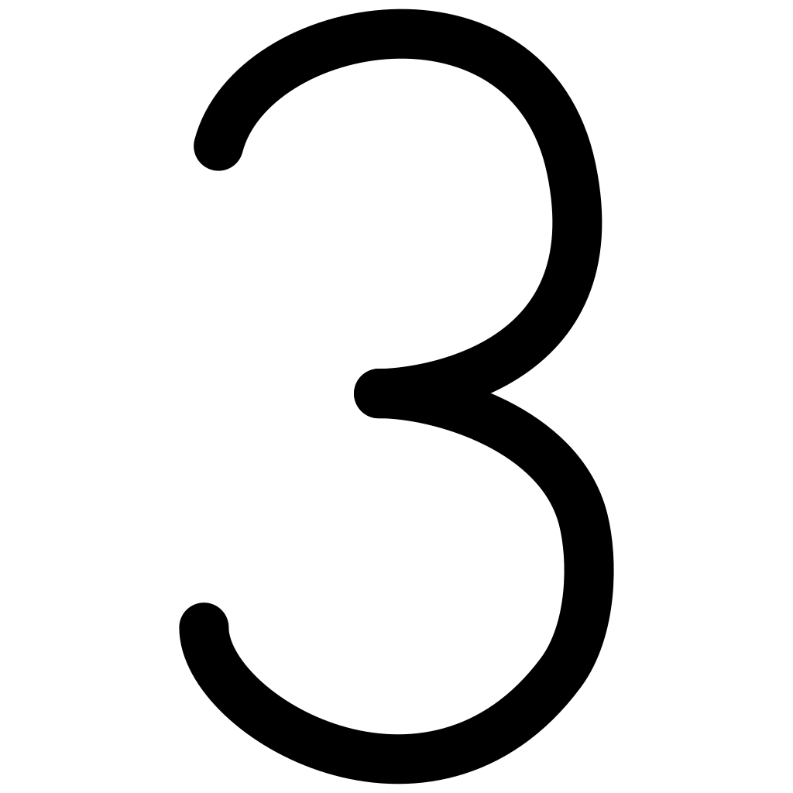</td><td></td><td>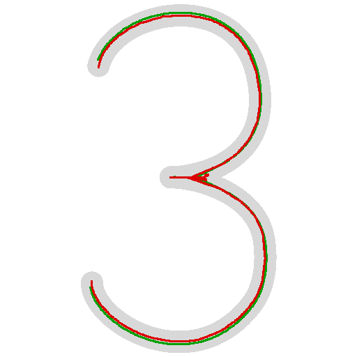</td></tr>
<tr><td><code>number_6</code></td><td>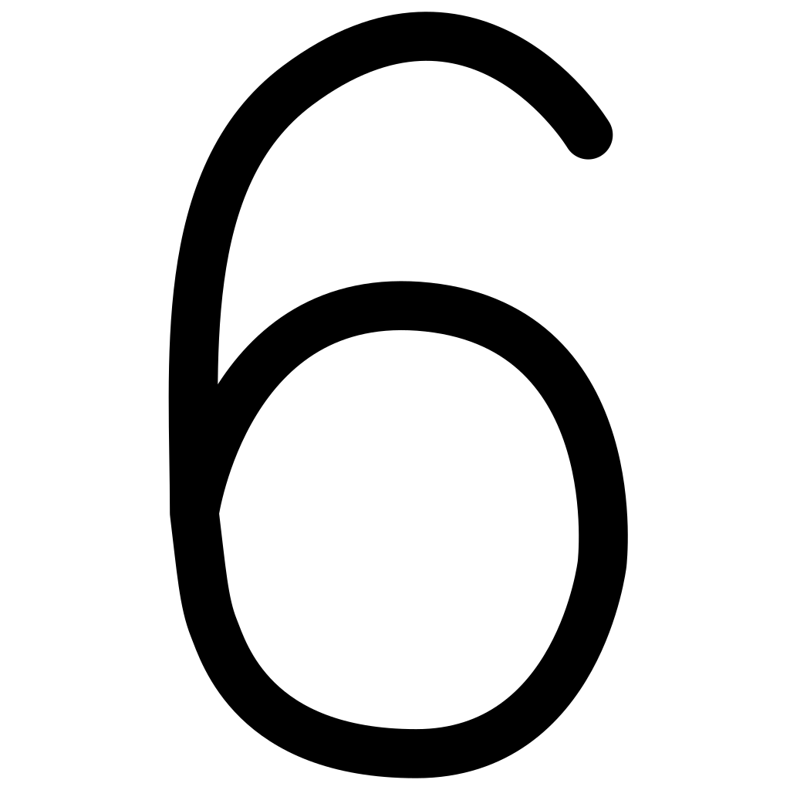</td><td></td><td>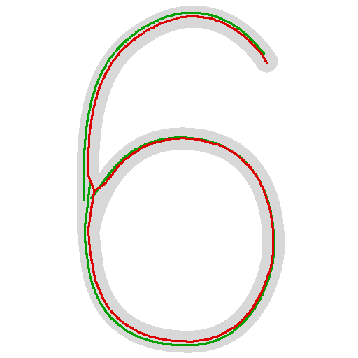</td></tr>
<tr><td><code>ampersand</code></td><td>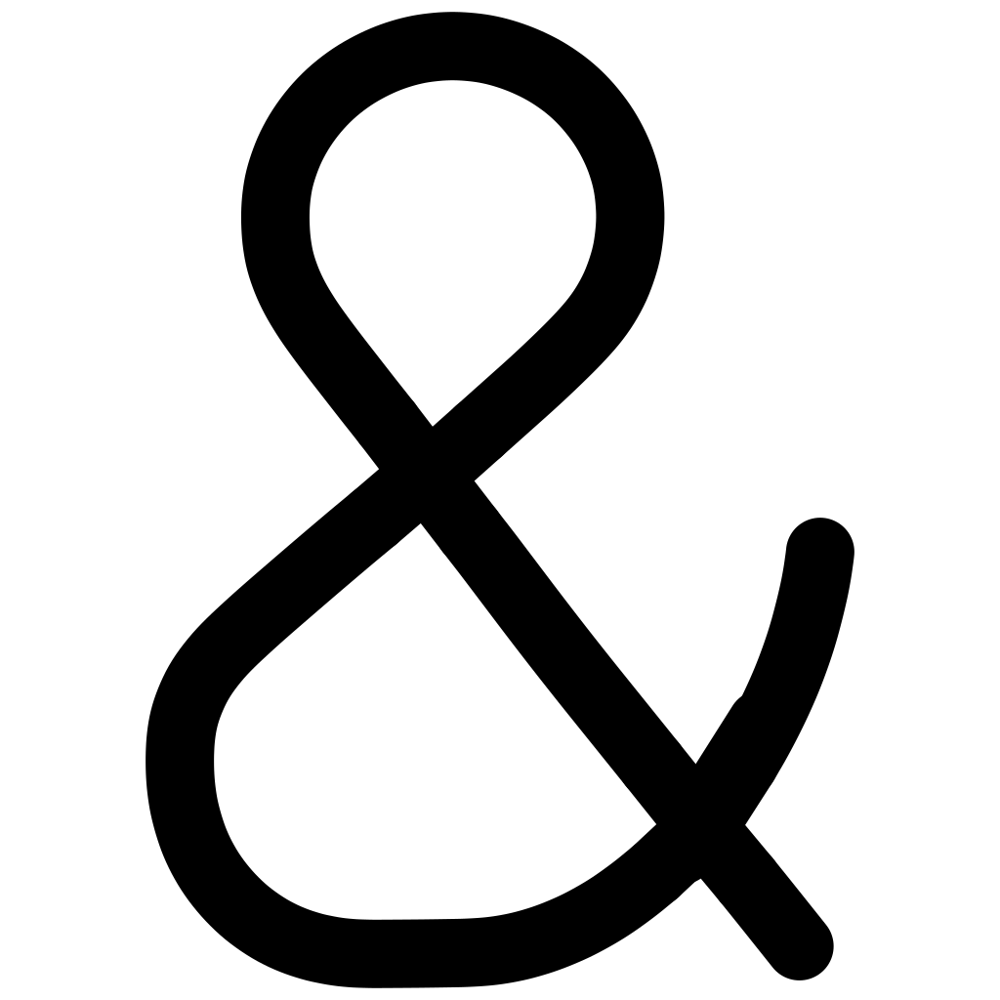</td><td></td><td>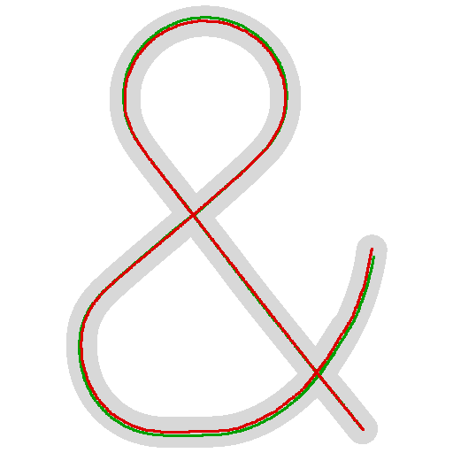</td></tr>
</table>

The overlay column shows the same `letter_H` centerline difference discussed in §2 and §6 — green reference verticals at x≈177 vs ours at x≈192.

---

## 2. The challenge

A reference set of SVGs was provided alongside the PNGs (now in `data/reference/`). The task is to reproduce the *structure* — centerline paths that, when stroked, re-draw the glyph — and beat the reference on **shape reconstruction fidelity**.

Two metrics are reported (see `test_compare.py`):

1. **Reference IoU** — rasterize our SVG and the reference SVG as thin strokes, compare overlap. Not expected to reach 1.0: for some shapes the reference centerlines sit offset from where the medial axis falls (e.g. on `letter_H` the reference verticals sit at x≈177 while our estimate places them at x≈192). This is a structural difference between the two centerline choices, not a defect on either side — so 1.0 is neither reachable nor a useful target for this metric.
2. **Reconstruction IoU (RecOut / RecRef)** — the fair, reference-independent metric: rasterize an SVG at the **full stroke width** and compare against the input PNG mask. Measures how faithfully the centerlines re-draw the original shape. Computed for both our output (`RecOut`) and the reference (`RecRef`) as a baseline.

---

## 3. Pipeline

```text
PNG → Decode → Binarize → Chamfer Distance Transform → Contour Trace
→ Perpendicular Ray Marching → Midpoint Samples → Chain by Contour Order
→ Clearance Jump Split → Dedupe → Junction Resolution → Topology Split/Connect
→ RDP Simplify → Axis Snap → Smooth → SVG
```

### Stage by stage

The overall intent: a centerline is the *medial axis* of a stroke — the locus of points equidistant from both stroke edges. We don't compute the medial axis directly (morphological thinning is noisy and breaks topology at junctions). Instead we **approximate it by sampling from the contour**: from each boundary point we shoot a perpendicular chord straight across the stroke to the opposite edge; the chord's midpoint is a good centerline candidate. We then keep the midpoints that pass the centeredness test (see below), link them into polylines, and repair the topology the sampling deliberately broke at junctions. The result is an *approximation* of the medial axis — accurate on straight strokes, and slightly biased on tight curves where the chord is perpendicular to one edge only.

| Stage | File | What happens | Why |
|-------|------|--------------|-----|
| **Decode** | `src/png_decode.py` | Pure-Python PNG decoder (handles 8-bit gray, RGBA, 1-bit palette) → raw pixel array | No third-party deps allowed, so the decoder is hand-rolled. Output is the grid the rest of the pipeline consumes. |
| **Binarize + DT** | `src/centerline_extract.py` | Threshold pixels into a black/white mask, then a two-pass 3-4 **chamfer distance transform** gives every interior pixel its *clearance* (distance to the nearest edge in pixels). | The clearance field is the backbone of every later correctness check: the medial axis is exactly where clearance is locally maximal, and half a stroke's width equals the clearance on its centerline. Chamfer (not exact Euclidean) is fast and pure-Python. |
| **Contour trace** | `src/centerline_extract.py` | **Moore-style boundary following** walks the black region's edge and returns every contour (outer boundaries + holes) as an ordered pixel list. | The contour is where we *stand* to sample the skeleton. Walking it in order means consecutive centerline samples come from consecutive stroke positions, so chaining them yields a coherent polyline instead of a scatter. |
| **Chord midpoint** | `src/centerline_extract.py` | At each contour sample: estimate the local **tangent** of the boundary, take the perpendicular pointing *into* the shape, march that ray across the stroke until it exits the black region, and take the **midpoint** of the crossing as a centerline candidate. The midpoint is then refined to where clearance peaks along the chord. | The perpendicular chord across a stroke of width *w* has its midpoint on the medial axis by construction. Refining to the clearance peak corrects the bias that curvature introduces (the chord is perpendicular to one side only, not both). |
| **Centeredness filter** | `src/centerline_extract.py` | Keep a midpoint **only if** its chamfer clearance ≈ half the chord length (within a strict tolerance). | The key correctness gate. On the medial axis, clearance = half-width by definition; a ray that cuts a corner or leaks through a junction produces a midpoint whose clearance no longer matches half the chord length, so it is rejected. This makes chains **break cleanly** at junctions and caps instead of drifting into hooks — at the cost of intentionally leaving gaps for the topology stage to repair. |
| **Chain** | `src/centerline_extract.py` | Link surviving midpoints in contour order into initial polylines, breaking on large contour-index or spatial gaps. Wrap-around on the closed contour is handled so a loop's chain closes. | Produces the raw centerline tracks. Note each stroke is sampled from **both** contour sides, so every stroke appears as two near-parallel tracks — handled by the next stage. |
| **Clearance-jump split** | `src/skeleton_graph.py` | Break a chain wherever a point's clearance jumps well above (or below) the local running median. | Catches the midpoints the centeredness filter missed: near a junction the chord escapes sideways, the midpoint drifts into the junction blob and its clearance spikes. Splitting there isolates the stray geometry so junction resolution can rebuild cleanly. |
| **Dedupe** | `src/skeleton_graph.py` | Each stroke is sampled from both sides → two nearly identical tracks; a track can also fold back on itself around a rounded cap. Sort by length, keep the longest, drop points that duplicate already-kept geometry or the same track's geometry from a distant arc position (fold-back). | Collapses the double-coverage back to one centerline per stroke and removes cap-wrap artefacts, without throwing away genuinely separate strokes. |
| **Junction resolution** | `src/skeleton_graph.py` | Reconnect the topology the centeredness filter intentionally broke. (a) **Endpoint clusters**: 2 nearby free ends → corner join at the intersection of their tangents (elbows, sharp tips, loop closures); 3+ ends → shared junction *hub* placed where the branch tangent rays meet (e.g. deep inside an arrowhead vertex). (b) **T-connections**: walk a free endpoint forward along the clearance ridge until it lands on a passing path (e.g. the H crossbar reaching a stem). (c) **Cap extension**: push remaining free ends toward the stroke tip until clearance drops to the cap radius, so round caps fill the tip. | The sampling stage *must* break at junctions to stay accurate, so this stage is the explicit repair pass that restores connectivity. The cap walk is what makes stroked output reconstruct the original glyph's tips faithfully. |
| **Topology finalize** | `src/skeleton_graph.py` | Detect crossing hubs (segment intersections + endpoint clusters), **split** paths at those hubs so each arm stops at the junction, then add short **junction connectors** and **bridge** nearby free endpoint gaps (loop openings, stem gaps). | Mirrors the reference SVG's structure — separate arms meeting at junction points — while keeping continuous centerlines where the reference over-fragments. Bridges close loops the contour sampling couldn't (e.g. the opening of `number_6`). |
| **Collinear merge** | `src/skeleton_graph.py` | Merge path pieces whose endpoint tangent directions are nearly parallel and endpoints are close, skipping perpendicular arms and short stubs. | After splitting stems at junction hubs, the two halves of one stem are collinear; this re-joins them into a single long path while leaving genuine perpendicular branches (e.g. an H's crossbar) separate. |
| **Simplify + snap** | `src/path_fit.py` | RDP simplification → straight-line collapse (replace near-straight polylines with a single segment) → axis-aligned snap (lock nearly-horizontal/vertical strokes to a clean axis) → spike removal → resample at fixed spacing → moving-average smooth. | Reduces point count to a clean vector path and removes sub-pixel jitter from the contour sampling. Axis snap is what makes letter verticals/horizontals render crisp. Smoothing is light (window 3) so corners aren't rounded off. |
| **Write** | `src/svg_writer.py` | Emit `<path d="M … L …">` elements (one per polyline) with the auto-estimated stroke width. | Final SVG. `L` segments only — no curves — because the centerlines are already smooth enough; keeping it straight-line makes the output trivially inspectable and editable. |

A **spatial hash** (`src/spatial_hash.py`) backs every nearest-point / range query used above (dedupe, pruning, T-connection hit tests, junction endpoint clustering). It keeps the topology stage quadratic-in-practice rather than quadratic-in-input-size.

---

## 4. Usage

### Requirements
- Python 3.10+ (uses standard library only — no `pip install` needed).

### Run on the sample set

All commands are run from the repo root.

```bash
# Process every PNG in data/input/ → write SVGs to out/
python src/main.py data/input out

# Score the output against the reference set (data/reference/)
python src/test_compare.py

# Render an overlay diagnostic (PNG + our paths in red + reference in green)
python src/visualize.py overlay letter_H
```

### Process your own PNGs

```bash
python src/main.py path/to/your/pngs path/to/output
```

Input PNGs must be solid black shapes on a light/transparent background (see `data/input/*.png`).

### Optional flags

| Flag | Default | Meaning |
|------|---------|---------|
| `--stroke-width` | auto | SVG stroke width in px. `None`/auto = estimate per shape from the distance transform (~64 px for these icons). |
| `--spacing` | 4.0 | Resample spacing along simplified polylines |
| `--smooth-window` | 3 | Moving-average window for final smoothing |
| `--sample-step` | 2 | Contour sampling step (px) |
| `--rdp-epsilon` | 2.0 | RDP simplification tolerance |

> **Stroke width note:** the PNG strokes are ~65 px wide, while the reference SVGs use a fixed 45 px. Auto-estimate uses the 72nd-percentile ridge clearance ×2 (upper quartile tracks full stroke width better than the median, which junction blobs pull down), clamped to [40, 80].

---

## 5. Results

Run `python src/test_compare.py` after `python src/main.py data/input out`.

| Shape | Paths (out/ref) | Ref IoU | RecOut | RecRef |
|-------|:-:|:-:|-:|-:|
| letter_H | 3/11 | 0.569 | **0.940** | 0.594 |
| letter_K | 5/13 | 0.529 | **0.917** | 0.577 |
| arrow-turn-down-left | 3/10 | 0.950 | **0.947** | 0.642 |
| arrow-pointer | 5/31 | 0.765 | **0.922** | 0.683 |
| number_3 | 3/5 | 0.786 | **0.927** | 0.718 |
| number_6 | 1/5 | 0.705 | **0.920** | 0.692 |
| ampersand | 5/18 | 0.840 | **0.945** | 0.675 |
| **Average** | | **0.735** | **0.931** | 0.654 |

**Reading the table**

- **RecOut** (ours) beats **RecRef** (reference) on every shape — average **0.931 vs 0.654**, i.e. our centerlines reconstruct the original glyph ~43% more faithfully. This comes from the centerlines tracking the medial axis and the stroke width matching the PNG.
- **Ref IoU** is lower because it compares thin-stroke raster overlap between two centerline choices that do not always coincide — 1.0 is neither reachable nor meaningful there (see §2).
- **Path counts differ** by design: the reference splits every junction into many small connector segments (e.g. `arrow-pointer` → 31 paths); we merge more aggressively into fewer, longer paths while keeping reconstruction quality higher.

---

## 6. Known limitations

- **Centerline choice differs from reference**: for `letter_H` the reference verticals sit at x≈177 while ours sit at x≈192 (where the medial axis falls). This is a difference in objective: the reference is a structural target, while ours is optimized for PNG reconstruction — but it means thin-stroke overlap (Reference IoU) can't approach 1.0. Visible in `visualize.py overlay` (green = reference, red = ours).
- **Approximation, not exact medial axis**: the chord-midpoint method is exact on straight strokes but biased on tight curves (the chord is perpendicular to one edge only). The refinement to the clearance peak mitigates this but does not eliminate it.
- **Path count vs reference**: reference fragments junctions into connector sub-paths; we keep continuous centerlines. Different structure, higher reconstruction fidelity.
- **Complex loops**: `number_6` keeps 1 main continuous path vs reference 5; the loop-opening connector is partially implicit in the continuous centerline.
- **Decoder scope**: `png_decode.py` handles the color types used by the sample set (8-bit grayscale, RGBA, +1-bit via palette). Exotic PNG filter/color-type combos are not exhaustively supported.

---

## 7. File map

```
svg-png/
├── src/                    pipeline source (standard library only)
│   ├── main.py             CLI entry point — orchestrates the full pipeline
│   ├── png_decode.py       Pure-Python PNG decoder → raw pixels
│   ├── centerline_extract.py  Binarize, chamfer distance transform, contour trace, perpendicular chord-midpoint centerline extraction (+ centeredness filter)
│   ├── skeleton_graph.py   Clearance-jump split, dedupe, junction/cap resolution, topology finalize, collinear merge, fragment pruning
│   ├── spatial_hash.py     Spatial hash grid for fast nearest-point / range queries
│   ├── path_fit.py         RDP simplify, straight-line fit, axis snap, spike removal, resample, smooth
│   ├── svg_writer.py       SVG output (`<path d="M … L …">` + stroke width)
│   ├── test_compare.py     Reference IoU + reconstruction IoU scoring suite
│   └── visualize.py        Overlay PNG diagnostics (input + our paths + reference)
├── data/
│   ├── input/              Input PNG glyphs (the challenge sample)
│   └── reference/          Provided reference SVGs
├── out/                    Generated SVG output (one per input glyph)
├── diagnostics/            Pre-rendered overlay diagnostics (`viz_overlay_*.png`)
├── docs/
│   ├── Centerline extraction.txt   The challenge brief
│   └── compare.html        Side-by-side SVG comparison page
├── README.md
└── .gitignore
```

---

## 8. Reproducing the results

From the repo root:

```bash
python src/main.py data/input out        # 1. generate SVGs
python src/test_compare.py                # 2. print the results table
python src/visualize.py overlay letter_H  # 3. (optional) inspect one shape
```

Expected: the table in §5, with `out/*.svg` written and `RecOut` ≥ `RecRef` on every shape.